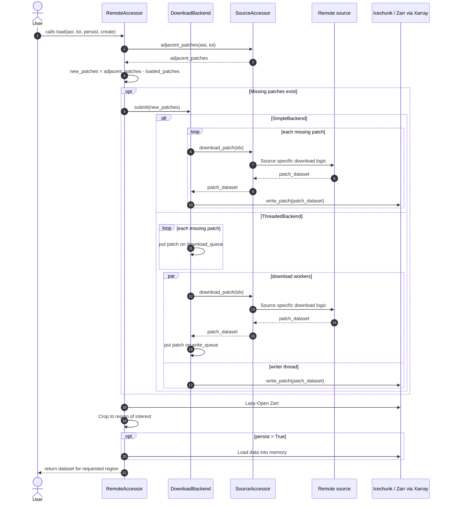

# Architecture and Design

!!! tip
    It is expected that the [How it Works Guide](how_it_works.md) were read and understood.

`Smart Geocubes` is built around a procedural download workflow:
the local Zarr store is treated as a product in its own right, and the library only fills in missing parts on demand.

The libraries design goals are user-orientated - the user should be able to:

- open the datacube even without this library once downloaded via XArray or Icechunk (Zarr).
- _easily_ add new datasets from supported remote sources
- add support for new / own remote sources

The architecture is split into three layers:

1. Specific dataset accessors
2. Remote source adapters
3. Storage

The lowest level, the **storage abstraction**, is the `core` of the library.
At its heart is a `RemoteAccessor` abstract base class which contains most logic.
It utilizes one of the two `DownloadBackends`, `SimpleBackend` and `ThreadedBackend`, which orchestrate the downloading and writing of patches / tiles.
Source dependent accessors inherit from `RemoteAccessor` and define how a patch / tile is downloaded from the remote.
Then dataset specific accessors further inherit from these source dependent accessors specifying the dataset's configuration and metadata.

## Loading a partially downloaded region

Once the user wants to `load()` a specific region of a dataset, logic defined in the `RemoteAccessor` ABC uses the source specific accessor to check which patches / tiles are adjacent to the region of interest.
If all adjacent patches are already contained in the local datacube, the datacube will be opened at the region of interest.
Otherwise, the `RemoteAccessor` requests its `DownloadBackend` to download the missing patches, which call the source specific accessors download function.
The `SimpleBackend` iterates over the requested patches, downloads and then writes them one by one.
A more efficient approach is utilized by the `ThreadedBackend`, where multiple patches are downloaded and written in parallel.

The diagram below shows this common control flow.

