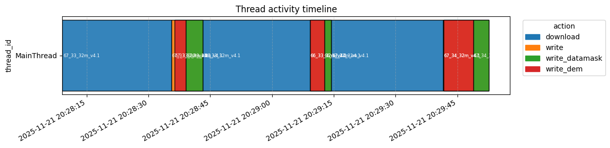
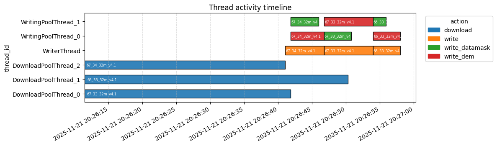

# Download Backends

!!! tip
    It is expected that the [How it Works Guide](how_it_works.md) and [Architecture](architecture.md) pages were read and understood.

Whenever `load()` finds patches / tiles that are not yet in the local datacube, it hands them off to a `DownloadBackend`.
The backend is responsible for downloading the missing patches from the source and writing them into the Zarr datacube.
`Smart-Geocubes` ships two implementations, `SimpleBackend` and `ThreadedBackend`, which trade simplicity for throughput.

You select the backend when constructing an accessor:

```python
import smart_geocubes

# Uses the default backend ("threaded")
accessor = smart_geocubes.ArcticDEM32m("datacubes/arcticdem_32m.icechunk")

# Explicitly pick a backend
accessor = smart_geocubes.ArcticDEM32m("datacubes/arcticdem_32m.icechunk", backend="simple")
```

## SimpleBackend

`SimpleBackend` processes patches strictly one after another: for each patch it downloads the data, then writes it to the Zarr store, then moves on to the next patch.
Everything happens on a single thread, so there is no concurrency to reason about, which makes it the easiest backend to debug and the safest choice in a multiprocessing environment (e.g. one `ProcessPoolExecutor` worker per region), where each process already gets its own backend instance.
It also has no minimum Python version requirement.

The Gantt chart below shows a `SimpleBackend` run downloading and writing three patches: the single `MainThread` alternates between one long `download` bar and short `write` / `write_datamask` / `write_dem` bars, one patch at a time, with no overlap.

{ loading=lazy }

## ThreadedBackend

`ThreadedBackend` decouples downloading from writing so both can happen concurrently:

- Downloads: a pool of downloader threads (`concurrent_downloads`, default `4`) fetches multiple patches from the source in parallel.
- Download→write buffer: a bounded queue (`maxsize=2`) sits between the download pool and the writer thread. Once **2** completed-but-unwritten patches are buffered, further finished downloads block until the writer catches up — so downloads can get at most 2 patches ahead of writing.
- Writes: a single writer thread handles one patch at a time, but fans out that patch's per-variable writes to a pool of **4** workers, so multiple variables of the same patch (e.g. a DEM's `dem` and `datamask`) are written concurrently.
- Writes are retried up to 100 times on `icechunk.ConflictError` (concurrent commits from other writers), and downloads are retried up to 5 times on failure.

This backend requires **Python 3.13 or newer**, since it relies on `queue.Queue.shutdown()` to tear down the write queue cleanly. Constructing an accessor with `backend="threaded"` (the default) on an older Python raises `NotImplementedError`; use `backend="simple"` if you're on Python 3.12 or need multiprocessing-safe behavior.

The Gantt chart below shows the same three-patch workload as above, but on `ThreadedBackend`: three `DownloadPoolThread`s run in parallel, and the `WriterThread` dispatches overlapping `write_dem` / `write_datamask` work to `WritingPoolThread_0` / `WritingPoolThread_1` as soon as each download finishes. The whole batch completes in roughly half the wall-clock time of the `SimpleBackend` run.

{ loading=lazy }

## Which one should I use?

`ThreadedBackend` is the default and the recommended choice for most workloads: it has proven stable and gives higher download throughput by overlapping network I/O with disk writes.
Prefer `SimpleBackend` when you need deterministic, easy-to-debug behavior, when you're distributing work across processes rather than threads, or when you're stuck on Python 3.12.
