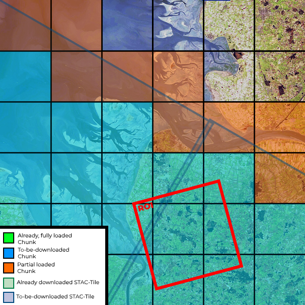
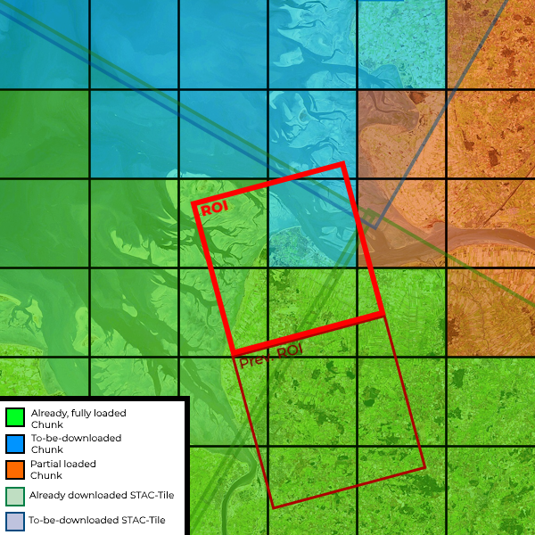

---
hide:
  - navigation
---

# How does it work?

!!! example "Uncomplete and out of date"

    As of right now, this documentation page is just copied from the DARTS documentation.
    It will be updated in the future.

## Why Zarr Datacubes?

Zarr is a file format for storing chunked, compressed, N-dimensional arrays.
It is designed to store large arrays of data, and to facilitate fast and efficient IO.
Zarr works well integrated with Dask and Xarray.

By storing the auxiliary data in Zarr Datacubes, it is much easier and faster to access the data of interest.
If we would use GeoTiffs, we would have to first create a Cloud-Optimized GeoTiff (COG), which is basically an ensemble (mosaic) of multiple GeoTiffs.
Then we would have to read from the COG, which behind the scenes would open multiple GeoTiffs and crops them to fit the region of interest.
E.g. Opening a specific region of interest 10km x 10km from a 2m resolution COG would take up to 2 minutes, if the COGs extend is panarctic.
Opening the same region from a Zarr Datacube takes less than 1 second.

## Procedural download

!!! info
    The currently used auxiliary data is downloaded on demand, only data actually used is downloaded and stored on your local machine.
    Hence, the stored datacubes can be thought of as a **cache**, which is filled with data as needed.

There are currently two implementations of the procedural download used: a cloud based STAC download and a download via Google Earth-Engine.

Because the single tiles of the STAC mosaic can be overlapping and intersect with multiple Zarr chunks, the STAC download is slightly more complicated.
Since Google Earth-Engine allows for exact geoboxes, download of the exact chunks is possible. This reduces the complexity of the download.

|        | STAC                                                                                  | GEE                                                                                 |
| -----: | ------------------------------------------------------------------------------------- | ----------------------------------------------------------------------------------- |
| 1. ROI | { loading=lazy } | { loading=lazy } |
| 2. ROI | { loading=lazy } | { loading=lazy } |

The above graphics shows the difference between loading data from STAC (left) and Google Earth-Engine (right).
With the STAC download, the data is downloaded from a mosaic of tiles, which can be overlapping with each other and cover multiple Zarr chunks.
It may occur that a chunk is not fully covered by the STAC mosaic, which results in only partial loaded chunks.
In such cases, the missing data in these chunks will be updated if the other intersecting tile is downloaded, which may occur to a later time if a connected ROI is requested.
The download process is much easier for GEE, since one can request the exact geoboxes of the Zarr chunks and GEE will handle the rest.
Hence, chunks will always be fully covered by the downloaded data.

Regarding the open ROI process, both implementations follow the same principle:

1. Check which Tiles / Chunks intersect with the region of interest
2. Dowload all new Tiles / Chunks
3. Store the new Tiles / Chunks in their specific Zarr chunks
4. Return the region of interest of the Zarr Datacube

### STAC download

{ loading=lazy }

### Google Earth-Engine download

{ loading=lazy }
