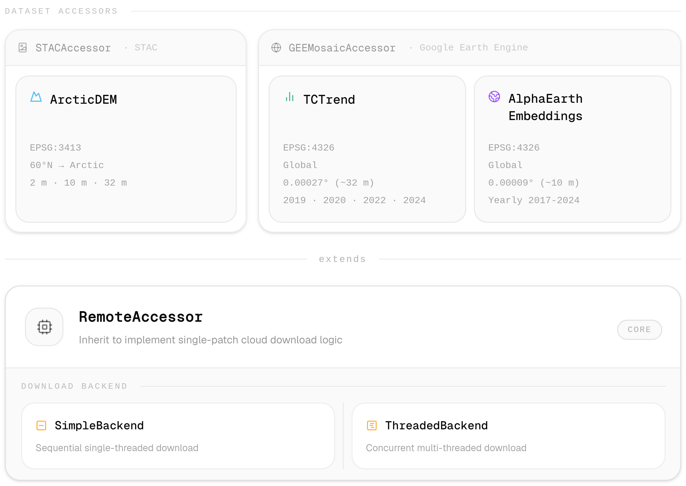

# Summary

The size of modern spatio-temporal datasets require that the experiment phase is only done on subsets, e.g. a few regions.
As data formats and access methods vary widely in the geospatial community, this creates a scaling issue when an algorithm or model is expanded to the more and larger regions.
`Smart-Geocubes` provides utilities for accessing such data in an efficient and scalable manner by applying a local-first strategy in form of `Zarr` datacubes, similar to a cache.

# Statement of need

Modern geospatial workflows, such as training image segmentation models, combining datasets, or change detection analysis, benefit from local experimentation due to fast feedback loops.
However, contemporary geospatial datasets are often too large for local storage;
for example, `AlphaEarth embeddings` require approximately 500 TB, while the `Sentinel-2` archive exceeds 40 PB.
Data is further distributed across heterogeneous platforms (Google Earth Engine, Planetary Computer, STAC catalogs) and formats (`Zarr`, `GeoTIFF`, `COG`, `NetCDF`).

Researchers must therefore download subsets of remote data while retaining the ability to incrementally add new regions without restructuring workflows.
Due to it's chunk-based storage system, `Zarr` is most suitable for incrementally addition of sparse data.
Existing solutions such as Kerchunk and `VirtualiZarr` enable on-the-fly conversion from legacy formats to a Zarr-like data interface but require re-downloading data on each session. [@Nicholas_VirtualiZarr]
`Smart-Geocubes` addresses this by procedurally downloading remote data subsets and persisting them in a `Zarr` store backed by Icechunk.
This ensures rapid repeated access across sessions, supports incremental data addition without workflow changes, and downloads each chunk at most once, making the approach scalable as projects transition from experimentation to production.
While pre-downloading regions of interest is an common and battle-tested approach, `Smart-Geocubes` is designed to ease, improve and unify this approach for geospatial researchers requiring local-first workflows with cloud-scale data.

# State of the field

The closest software to this library is probably `VirtualiZarr`. [Nicholas_VirtualiZarr]
`VirtualiZarr` allows for easy access to archival data in form of virtual Zarr datacubes without duplicating any data.
It does that by creating so called Manifests which maps byte ranges of the remote data to chunks of a virtual Zarr array.
On access of a specific region, `VirtualiZarr` downloads or opens the respective byte ranges and combines them.
While the Manifests are persisted locally to disk, the data is not.
For Cloud-native workflows this may be sufficient, as the compute probably happens on the same infrastructure as the data.
However, local first experimentation may suffer from repeated data downloads.

`Smart-Geocubes` was build independent from `VirtualiZarr`, as it explicitly was build arounda no-data-duplication principle.
Further, `Smart-Geocubes` was build with custom parallelization through frameworks like e.g. Ray in mind, while `VirtualiZarr` is strongly integrated in the `Xarray`-`Dask` ecosystem.

# Software design

The central design decision was adopting a procedural download paradigm: the local `Zarr` store is treated as a persistent cache incrementally populated on demand.
This balances offline access to downloaded regions against avoiding upfront data transfer costs, streaming would result in repeated downloads and thus unnecessary data transfers, while pre-downloading entire archives is impractical for terabyte-scale datasets and often not needed.

The choice of `Zarr` as the storage format stems from it's read and write performance and from it's inherent support for sparsity within data due to it's chunk-based format.
Further, `Zarr` has started to become the standard format for geospatial data over the recent years with major support and integration through libraries like `Xarray`.
With the development of `Icechunk`, `Zarr` was extented by an transactional storage engine allowing for safe, semi-coordinated reads and writes.
Thus utilizing `Icechunk` as the `Zarr` storage backend allowed `Smart-Geocubes` to ensure that parallel writes do not conflict or result in data loss, allowing fearless integration into parallelization frameworks like `Ray`.
Interoperability between these two libraries marks another core principle: data stored by `Smart-Geocubes` can be opened by both `Xarray` and natively as `Zarr` via `Icechunk`.

The architecture is separated into three layers: dataset-specific accessors, remote source adapters, and the storage abstraction.
The `RemoteAccessor` abstract base class forms the core, implementing common logic for patch identification and download coordination.
Source-dependent accessors inherit from this class to define remote-specific retrieval, while dataset-specific accessors further inherit to specify configuration and metadata.
The inheritance hierarchy enables extensibility: adding a new dataset from an existing source requires only a dataset-specific accessor, while supporting a new remote source requires implementing a source adapter that inherits from `RemoteAccessor`.

Two `DownloadBackend` implementations coordinate downloads and writes: The `SimpleBackend` processes patches sequentially, straightforward and debuggable, while the `ThreadedBackend` uses worker threads and queues to download and write in parallel, providing higher throughput at the cost of added complexity.
The User can select based on their network setup, overall the `ThreadedBackend` prooved stable and is the recommended backend due to it's advanced efficiency.

# Research impact statement

`Smart-Geocubes` has demonstrated significant research impact as beeing a core component in the `darts-nextgen` data pipeline and as an essential data-engineering component in at least one other paper. [@Holzer_DARTS-nextgen; @Nesterova2026]

# AI usage disclosure

The use of LLMs and adjacent tools were used across various aspects of this library:
VSCode's integrated GitHub Copilot was used as autocomplete, to write some tests, helped generate parts of the documentation and to create the changelog.
As the work was done over several years by now, different models were utilized.
Only models available in the free student tier of GitHub Copilot were used.

The MiniMax-M2.7 model hosted by Blablador in the Jülich Supercomputing Center was used via the Jan desktop app to corrent spelling and grammar of this paper.

# Acknowledgements

Most of this library was written as part of the Permafrost Discovery Gateway, funded by Google through Woodwell Climate.

# References
